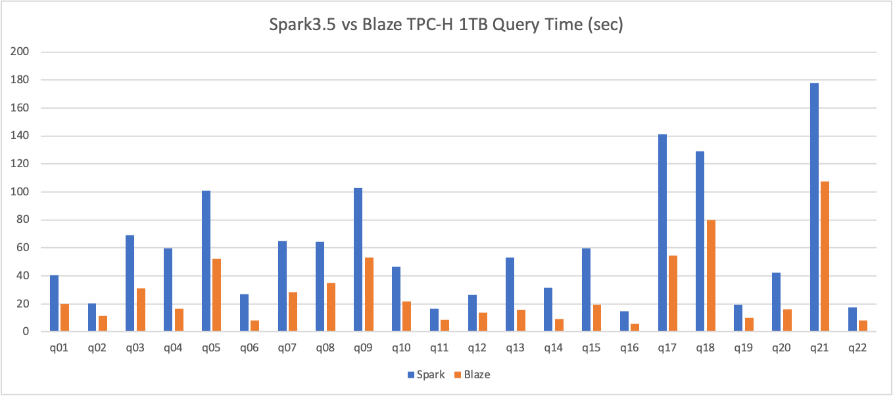

<!---
  Copyright 2022 The Blaze Authors
  
  Licensed under the Apache License, Version 2.0 (the "License");
  you may not use this file except in compliance with the License.
  You may obtain a copy of the License at

    http://www.apache.org/licenses/LICENSE-2.0 

  Unless required by applicable law or agreed to in writing, software
  distributed under the License is distributed on an "AS IS" BASIS,
  WITHOUT WARRANTIES OR CONDITIONS OF ANY KIND, either express or implied.
  See the License for the specific language governing permissions and
  limitations under the License.
-->

# BLAZE

[](https://github.com/blaze-init/blaze/actions/workflows/tpcds.yml)
[](https://github.com/blaze-init/blaze/actions/workflows/build-ce7-releases.yml)


The Blaze accelerator for Apache Spark leverages native vectorized execution to accelerate query processing. It combines
the power of the [Apache DataFusion](https://arrow.apache.org/datafusion/) library and the scale of the Spark distributed
computing framework.

Blaze takes a fully optimized physical plan from Spark, mapping it into DataFusion's execution plan, and performs native
plan computation in Spark executors.

Blaze is composed of the following high-level components:

- **Spark Extension**: hooks the whole accelerator into Spark execution lifetime.
- **Spark Shims**: specialized codes for different versions of spark.
- **Native Engine**: implements the native engine in rust, including:
  - ExecutionPlan protobuf specification
  - JNI gateway
  - Customized operators, expressions, functions

Based on the inherent well-defined extensibility of DataFusion, Blaze can be easily extended to support:

- Various object stores.
- Operators.
- Simple and Aggregate functions.
- File formats.

We encourage you to [extend DataFusion](https://github.com/apache/arrow-datafusion) capability directly and add the
supports in Blaze with simple modifications in plan-serde and extension translation.

## Build from source

To build Blaze, please follow the steps below:

1. Install Rust

The native execution lib is written in Rust. So you're required to install Rust (nightly) first for
compilation. We recommend you to use [rustup](https://rustup.rs/).

2. Install Protobuf

Ensure `protoc` is available in PATH environment. protobuf can be installed via linux system package
manager (or Homebrew on mac), or manually download and build from https://github.com/protocolbuffers/protobuf/releases .

3. Install JDK+Maven

Blaze has been well tested on jdk8 and maven3.5, should work fine with higher versions.

4. Check out the source code.

```shell
git clone git@github.com:kwai/blaze.git
cd blaze
```

5. Build the project.

Specify shims package of which spark version that you would like to run on.

Currently, we have supported these shims:

* spark-3.0 - for spark3.0.x
* spark-3.1 - for spark3.1.x
* spark-3.2 - for spark3.2.x
* spark-3.3 - for spark3.3.x
* spark-3.4 - for spark3.4.x
* spark-3.5 - for spark3.5.x.

You could either build Blaze in pre mode for debugging or in release mode to unlock the full potential of
Blaze.

```shell
SHIM=spark-3.3 # or spark-3.0/spark-3.1/spark-3.2/spark-3.3/spark-3.4/spark-3.5
MODE=release # or pre
mvn clean package -P"${SHIM}" -P"${MODE}"
```

Skip build native (native lib is already built, and you can check the native lib in `native-engine/_build/${MODE}`).

```shell
SHIM=spark-3.3 # or spark-3.0/spark-3.1/spark-3.2/spark-3.3/spark-3.4/spark-3.5
MODE=release # or pre
mvn clean package -P"${SHIM}" -P"${MODE}" -DskipBuildNative
```

After the build is finished, a fat Jar package that contains all the dependencies will be generated in the `target`
directory.

## Build with docker

You can use the following command to build a centos-7 compatible release:
```shell
SHIM=spark-3.3 MODE=release ./release-docker.sh
```

## Run Spark Job with Blaze Accelerator

This section describes how to submit and configure a Spark Job with Blaze support.

1. move blaze jar package to spark client classpath (normally `spark-xx.xx.xx/jars/`).

2. add the follow confs to spark configuration in `spark-xx.xx.xx/conf/spark-default.conf`:

```properties
spark.blaze.enable true
spark.sql.extensions org.apache.spark.sql.blaze.BlazeSparkSessionExtension
spark.shuffle.manager org.apache.spark.sql.execution.blaze.shuffle.BlazeShuffleManager
spark.memory.offHeap.enabled false

# suggested executor memory configuration
spark.executor.memory 4g
spark.executor.memoryOverhead 4096
```

3. submit a query with spark-sql, or other tools like spark-thriftserver:
```shell
spark-sql -f tpcds/q01.sql
```

## Integrate with Apache Celeborn
Blaze has supported Celeborn integration now, use the following configurations to enable shuffling with Celeborn:

```properties

# change celeborn endpoint and storage directory to the correct location
spark.shuffle.manager org.apache.spark.sql.execution.blaze.shuffle.celeborn.BlazeCelebornShuffleManager
spark.serializer org.apache.spark.serializer.KryoSerializer
spark.celeborn.master.endpoints localhost:9097
spark.celeborn.client.spark.shuffle.writer hash
spark.celeborn.client.push.replicate.enabled false
spark.celeborn.storage.availableTypes HDFS
spark.celeborn.storage.hdfs.dir hdfs:///home/celeborn
spark.sql.adaptive.localShuffleReader.enabled false
```

## Performance

Check [TPC-H Benchmark Results](./benchmark-results/tpch.md).
The latest benchmark result shows that Blaze saved more than 50% time on TPC-H 1TB datasets comparing with Vanilla Spark 3.5.

Stay tuned and join us for more upcoming thrilling numbers.

TPC-H Query time:


We also encourage you to benchmark Blaze and share the results with us. 🤗

## Community

We're using [Discussions](https://github.com/blaze-init/blaze/discussions) to connect with other members
of our community. We hope that you:
- Ask questions you're wondering about.
- Share ideas.
- Engage with other community members.
- Welcome others who are open-minded. Remember that this is a community we build together 💪 .


## License

Blaze is licensed under the Apache 2.0 License. A copy of the license
[can be found here.](LICENSE.txt)
