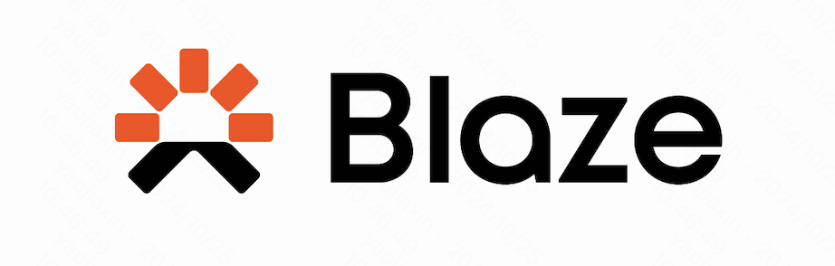
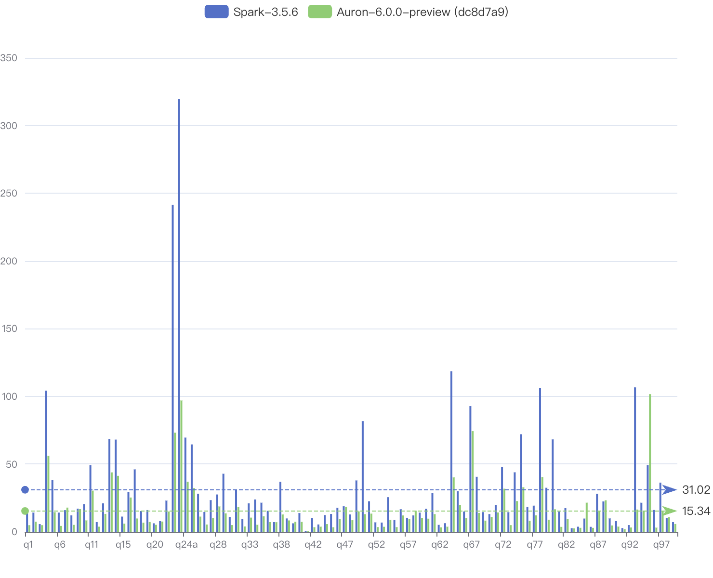

<!--
- Licensed to the Apache Software Foundation (ASF) under one or more
- contributor license agreements.  See the NOTICE file distributed with
- this work for additional information regarding copyright ownership.
- The ASF licenses this file to You under the Apache License, Version 2.0
- (the "License"); you may not use this file except in compliance with
- the License.  You may obtain a copy of the License at
-
-   http://www.apache.org/licenses/LICENSE-2.0
-
- Unless required by applicable law or agreed to in writing, software
- distributed under the License is distributed on an "AS IS" BASIS,
- WITHOUT WARRANTIES OR CONDITIONS OF ANY KIND, either express or implied.
- See the License for the specific language governing permissions and
- limitations under the License.
-->

# AURON

[](https://github.com/kwai/blaze/actions/workflows/tpcds.yml)
[](https://github.com/kwai/blaze/actions/workflows/build-ce7-releases.yml)

<p align="center"></p>

The Auron accelerator for Apache Spark leverages native vectorized execution to accelerate query processing. It combines
the power of the [Apache DataFusion](https://arrow.apache.org/datafusion/) library and the scale of the Spark distributed
computing framework.

Auron takes a fully optimized physical plan from Spark, mapping it into DataFusion's execution plan, and performs native
plan computation in Spark executors.

Auron is composed of the following high-level components:

- **Spark Extension**: hooks the whole accelerator into Spark execution lifetime.
- **Spark Shims**: specialized codes for different versions of spark.
- **Native Engine**: implements the native engine in rust, including:
  - ExecutionPlan protobuf specification
  - JNI gateway
  - Customized operators, expressions, functions

Based on the inherent well-defined extensibility of DataFusion, Auron can be easily extended to support:

- Various object stores.
- Operators.
- Simple and Aggregate functions.
- File formats.

We encourage you to [extend DataFusion](https://github.com/apache/arrow-datafusion) capability directly and add the
supports in Auron with simple modifications in plan-serde and extension translation.

## Build from source

To build Auron, please follow the steps below:

1. Install Rust

The native execution lib is written in Rust. So you're required to install Rust (nightly) first for
compilation. We recommend you to use [rustup](https://rustup.rs/).

2. Install JDK

Auron has been well tested on jdk8/11/17.

3. Check out the source code.

```shell
git clone git@github.com:kwai/auron.git
cd auron
```

4. Build the project.

use `./auron-build.sh` for building the project. execute `./auron-build.sh --help` for help.

After the build is finished, a fat Jar package that contains all the dependencies will be generated in the `target`
directory.

## Build with docker

You can use the following command to build a centos-7 compatible release:
```shell
SHIM=spark-3.3 MODE=release JAVA_VERSION=8 SCALA_VERSION=2.12 ./release-docker.sh
```

## Run Spark Job with Auron Accelerator

This section describes how to submit and configure a Spark Job with Auron support.

1. move auron jar package to spark client classpath (normally `spark-xx.xx.xx/jars/`).

2. add the follow confs to spark configuration in `spark-xx.xx.xx/conf/spark-default.conf`:

```properties
spark.auron.enable true
spark.sql.extensions org.apache.spark.sql.auron.AuronSparkSessionExtension
spark.shuffle.manager org.apache.spark.sql.execution.auron.shuffle.AuronShuffleManager
spark.memory.offHeap.enabled false

# suggested executor memory configuration
spark.executor.memory 4g
spark.executor.memoryOverhead 4096
```

3. submit a query with spark-sql, or other tools like spark-thriftserver:
```shell
spark-sql -f tpcds/q01.sql
```

## Integrate with Apache Celeborn
Auron has supported Celeborn integration now, use the following configurations to enable shuffling with Celeborn:

```properties

# change celeborn endpoint and storage directory to the correct location
spark.shuffle.manager org.apache.spark.sql.execution.auron.shuffle.celeborn.AuronCelebornShuffleManager
spark.serializer org.apache.spark.serializer.KryoSerializer
spark.celeborn.master.endpoints localhost:9097
spark.celeborn.client.spark.shuffle.writer hash
spark.celeborn.client.push.replicate.enabled false
spark.celeborn.storage.availableTypes HDFS
spark.celeborn.storage.hdfs.dir hdfs:///home/celeborn
spark.sql.adaptive.localShuffleReader.enabled false
```
## Integrate with Apache Uniffle
Auron supports integration with Apache Uniffle, a high-performance remote shuffle service for Apache Spark. 

To enable Uniffle as the shuffle manager in Auron, configure your Spark application with the following settings in 
`spark-defaults.conf` or via Spark submit options:

```properties

spark.shuffle.manager org.apache.spark.sql.execution.auron.shuffle.uniffle.AuronUniffleShuffleManager
spark.serializer org.apache.spark.serializer.KryoSerializer
spark.rss.coordinator.quorum <coordinatorIp1>:19999,<coordinatorIp2>:19999
spark.rss.enabled true
```
Notes:

* Uniffle Client Dependency: Ensure the Uniffle client library (e.g., `rss-client-spark3-shaded-0.9.2.jar` for Uniffle 0.9.2 or later) is included in your Spark application's classpath.
* Coordinator Endpoints: Replace `<coordinator-host>:19999` with the actual Uniffle coordinator address in your cluster.
* For detailed setup and advanced configuration, refer to the [Apache Uniffle Documentation](https://uniffle.apache.org/docs/client-guide).

## Performance

TPC-DS 1TB Benchmark (for details, see https://auron-project.github.io/documents/benchmarks.html):



We also encourage you to benchmark Auron and share the results with us. 🤗

## Community

We're using [Discussions](https://github.com/blaze-init/auron/discussions) to connect with other members
of our community. We hope that you:
- Ask questions you're wondering about.
- Share ideas.
- Engage with other community members.
- Welcome others who are open-minded. Remember that this is a community we build together 💪 .


## License

Auron is licensed under the Apache 2.0 License. A copy of the license
[can be found here.](LICENSE.txt)
