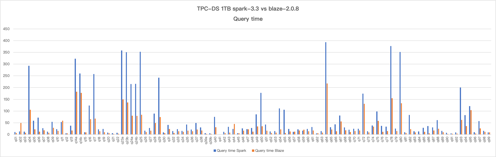
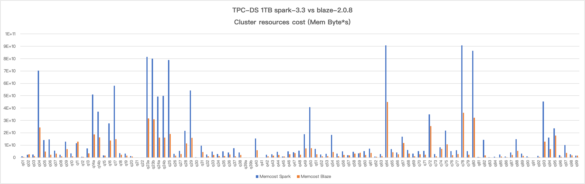

<!---
  Copyright 2022 The Blaze Authors
  
  Licensed under the Apache License, Version 2.0 (the "License");
  you may not use this file except in compliance with the License.
  You may obtain a copy of the License at

    http://www.apache.org/licenses/LICENSE-2.0 

  Unless required by applicable law or agreed to in writing, software
  distributed under the License is distributed on an "AS IS" BASIS,
  WITHOUT WARRANTIES OR CONDITIONS OF ANY KIND, either express or implied.
  See the License for the specific language governing permissions and
  limitations under the License.
-->

# BLAZE

[](https://github.com/blaze-init/blaze/actions/workflows/tpcds.yml)
[](https://github.com/blaze-init/blaze/actions/workflows/build-ce7-releases.yml)

The Blaze accelerator for Apache Spark leverages native vectorized execution to accelerate query processing. It combines
the power of the [Apache Arrow-DataFusion](https://arrow.apache.org/datafusion/) library and the scale of the Spark distributed
computing framework.

Blaze takes a fully optimized physical plan from Spark, mapping it into DataFusion's execution plan, and performs native
plan computation in Spark executors.

Blaze is composed of the following high-level components:

- **Spark Extension**: hooks the whole accelerator into Spark execution lifetime.
- **Spark Shims**: specialized codes for different versions of spark.
- **Native Engine**: implements the native engine in rust, including:
  - ExecutionPlan protobuf specification
  - JNI gateway
  - Customized operators, expressions, functions

Based on the inherent well-defined extensibility of DataFusion, Blaze can be easily extended to support:

- Various object stores.
- Operators.
- Simple and Aggregate functions.
- File formats.

We encourage you to [extend DataFusion](https://github.com/apache/arrow-datafusion) capability directly and add the
supports in Blaze with simple modifications in plan-serde and extension translation.

## Build from source

To build Blaze, please follow the steps below:

1. Install Rust

The native execution lib is written in Rust. So you're required to install Rust (nightly) first for
compilation. We recommend you to use [rustup](https://rustup.rs/).

2. Install JDK+Maven

Blaze has been well tested on jdk8 and maven3.5, should work fine with higher versions.

3. Check out the source code.

```shell
git clone git@github.com:blaze-init/blaze.git
cd blaze
```

4. Build the project.

_Specify shims package of which spark version that you would like to run on._
_You could either build Blaze in dev mode for debugging or in release mode to unlock the full potential of
Blaze._

```shell
SHIM=spark333 # or spark303
MODE=release # or dev
mvn package -P"${SHIM}" -P"${MODE}"
```

After the build is finished, a fat Jar package that contains all the dependencies will be generated in the `target`
directory.

## Build with docker

_You can use the following command to build a centos-7 compatible release:_
```shell
SHIM=spark333 MODE=release ./release-docker.sh
```

## Run Spark Job with Blaze Accelerator

This section describes how to submit and configure a Spark Job with Blaze support.

1. move blaze jar package to spark client classpath (normally `spark-xx.xx.xx/jars/`).

2. add the follow confs to spark configuration in `spark-xx.xx.xx/conf/spark-default.conf`:
```properties
spark.sql.extensions org.apache.spark.sql.blaze.BlazeSparkSessionExtension
spark.shuffle.manager org.apache.spark.sql.execution.blaze.shuffle.BlazeShuffleManager

# other blaze confs defined in spark-extension/src/main/java/org/apache/spark/sql/blaze/BlazeConf.java
```

3. submit a query with spark-sql, or other tools like spark-thriftserver:
```shell
spark-sql -f tpcds/q01.sql
```

## Performance

Check [Benchmark Results](./benchmark-results/20240202.md) with the latest date for the performance
comparison with vanilla Spark on TPC-DS 1TB dataset. The benchmark result shows that Blaze saved
~55% query time and ~60% cluster resources in average. ~6x performance achieved for the best case (q06).
Stay tuned and join us for more upcoming thrilling numbers.

Query time:


Cluster resources:


We also encourage you to benchmark Blaze and share the results with us. 🤗

## Community

We're using [Discussions](https://github.com/blaze-init/blaze/discussions) to connect with other members
of our community. We hope that you:
- Ask questions you're wondering about.
- Share ideas.
- Engage with other community members.
- Welcome others who are open-minded. Remember that this is a community we build together 💪 .


## License

Blaze is licensed under the Apache 2.0 License. A copy of the license
[can be found here.](LICENSE.txt)
