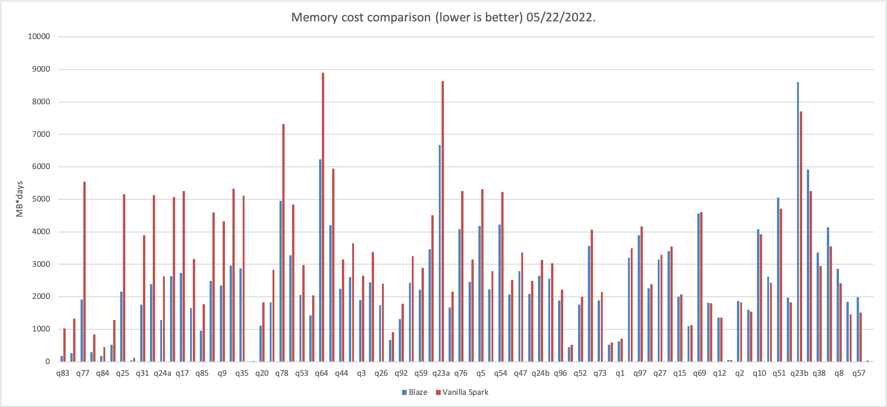

<!---
  Licensed to the Apache Software Foundation (ASF) under one
  or more contributor license agreements.  See the NOTICE file
  distributed with this work for additional information
  regarding copyright ownership.  The ASF licenses this file
  to you under the Apache License, Version 2.0 (the
  "License"); you may not use this file except in compliance
  with the License.  You may obtain a copy of the License at

    http://www.apache.org/licenses/LICENSE-2.0

  Unless required by applicable law or agreed to in writing,
  software distributed under the License is distributed on an
  "AS IS" BASIS, WITHOUT WARRANTIES OR CONDITIONS OF ANY
  KIND, either express or implied.  See the License for the
  specific language governing permissions and limitations
  under the License.
-->

# BLAZE
[](https://github.com/blaze-init/blaze-rs/actions/workflows/rust.yml)
[](https://github.com/blaze-init/blaze-rs/actions/workflows/tpcds.yml)


The Blaze accelerator for Apache Spark leverages native vectorized execution to accelerate query processing. It combines
the power of the [Apache Arrow-DataFusion](https://arrow.apache.org/datafusion/) library and the scale of the Spark distributed
computing framework.

Blaze takes a fully optimized physical plan from Spark, mapping it into DataFusion's execution plan, and performs native
plan computation in Spark executors.

Blaze is composed of the following high-level components:

- **Blaze Spark Extension**: hooks the whole accelerator into Spark execution lifetime.
- **Native Operators**: defines how each SparkPlan maps to its native execution counterparts.
- **JNI Gateways**: passing data and control through JNI boundaries.
- **Plan SerDe**: serialization and deserialization of DataFusion plan with protobuf.
- **Columnarized Shuffle**: shuffle data file organized in Arrow-IPC format.

Based on the inherent well-defined extensibility of DataFusion, Blaze can be easily extended to support:

- Various object stores.
- Operators.
- Simple and Aggregate functions.
- File formats.

We encourage you to [extend DataFusion](https://github.com/apache/arrow-datafusion) capability directly and add the
supports in Blaze with simple modifications in plan-serde and extension translation.

## Build from source

To build Blaze, please follow the steps below:

1. Install Rust

The underlying native execution lib, DataFusion, is written in Rust Lang. So you're required to install Rust first for
compilation. We recommend you to use `rustup`.

```shell
curl --proto '=https' --tlsv1.2 -sSf https://sh.rustup.rs | sh
```

2. Check out the source code.

```shell
git clone git@github.com:blaze-init/blaze.git
cd blaze
```

3. Build the project.

_You could either build Blaze in debug mode for testing purposes or in release mode to unlock the full potential of
Blaze._

```shell
./gradlew -Pmode=[debug|release] build
```

After the build is finished, a fat Jar package that contains all the dependencies will be generated in the `target`
directory.

## Run Spark Job with Blaze Accelerator

This section describes how to submit and configure a Spark Job with Blaze support.

You could enable Blaze accelerator through:

```shell
$SPARK_HOME/bin/spark-[sql|submit] \
  --jars "/path/to/blaze-engine-1.0-SNAPSHOT.jar" \
  --conf spark.sql.extensions=org.apache.spark.sql.blaze.BlazeSparkSessionExtension \
  --conf spark.shuffle.manager=org.apache.spark.sql.blaze.execution.ArrowShuffleManager301 \
  --conf spark.executor.extraClassPath="./blaze-engine-1.0-SNAPSHOT.jar" \
  .... # your original arguments goes here
```

At the same time, there are a series of configurations that you can use to control Blaze with more granularity.

| Parameter                                                         | Default value         | Description                                                                                      |
|-------------------------------------------------------------------|-----------------------|--------------------------------------------------------------------------------------------------|
| spark.executor.memoryOverhead                                     | executor.memory * 0.1 | The amount of non-heap memory to be allocated per executor. Blaze would use this part of memory. |
| spark.blaze.memoryFraction                                        | 0.75                  | A fraction of the off-heap that Blaze could use during execution.                                |
| spark.blaze.batchSize                                             | 16384                 | Batch size for vectorized execution.                                                             |
| spark.blaze.enable.shuffle                                        | true                  | If enabled, use native, Arrow-IPC based Shuffle.                                                 |
| spark.blaze.enable.[scan,project,filter,sort,union,sortmergejoin] | true                  | If enabled, offload the corresponding operator to native engine.                                 |


## Performance

We periodically benchmark Blaze locally with a 1 TB TPC-DS Dataset to show our latest results and prevent unnoticed
performance regressions. Check [Benchmark Results](./benchmark-results/tpc-ds.md) with the latest date for the performance
comparison with vanilla Spark.

Currently, you can expect up to a 2x performance boost, cutting resource consumption to 1/5 within several keystrokes.
Stay tuned and join us for more upcoming thrilling numbers.



We also encourage you to benchmark Blaze locally and share the results with us. 🤗

## Roadmap
### 1. Operators

Currently, there are still several operators that we cannot execute natively:
- Aggregate. Relies on https://github.com/apache/arrow-datafusion/issues/1570.
- Join with an optional filter condition. Relies on https://github.com/apache/arrow-datafusion/issues/2509.
- Broadcast HashJoin.
- Window.

### 2. Compressed Shuffle

We use segmented Arrow-IPC files to express shuffle data. If we could apply IPC compression,
we would benefit more from Shuffle since columnar data would have a better compression ratio. Tracked in [#4](https://github.com/blaze-init/blaze/issues/4).

### 3. UDF support
We would like to have a high-performance JVM-UDF invocation framework that could utilize a great variety
of the existing UDFs written in Spark/Hive language. They are not supported natively in Blaze at the moment.

## Community

We're using [Discussions](https://github.com/blaze-init/blaze/discussions) to connect with other members
of our community. We hope that you:
- Ask questions you're wondering about.
- Share ideas.
- Engage with other community members.
- Welcome others and are open-minded. Remember that this is a community we build together 💪 .


## License

Blaze is licensed under the Apache 2.0 License. A copy of the license
[can be found here.](LICENSE.txt)
