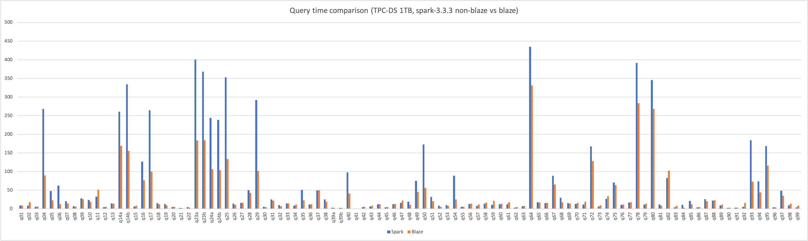
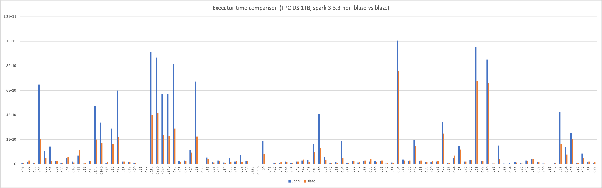

# Report 2023-09-25

### Versions
- Blaze version: [2.0.6](https://github.com/blaze-init/blaze/tree/v2.0.6)
- Vanilla spark version: spark-3.3.3

### Environment
Hadoop 2.6.0 cluster mode running on 4 nodes, See [Kwai server conf](./kwai1-hardware-conf.md).

### Configuration

- Blaze
```properties
spark.executor.memory 5g
spark.executor.memoryOverhead 3072
spark.blaze.memoryFraction 0.7
spark.blaze.enable.caseconvert.functions true
spark.blaze.enable.smjInequalityJoin false
spark.blaze.enable.bhjFallbacksToSmj false
```

- Vanilla Spark
```properties
spark.executor.memory 6g
spark.executor.memoryOverhead 2048
```

- Common configurations
```properties
spark.speculation false
spark.sql.adaptive.coalescePartitions.initialPartitionNum 1000
spark.sql.adaptive.coalescePartitions.minPartitionNum 20
spark.sql.adaptive.coalescePartitions.minPartitionSize 65536
spark.sql.files.maxPartitionBytes 268435456
spark.sql.autoBroadcastJoinThreshold 20971520
```

### Results
Query time comparison (seconds):


|      | Spark | Blaze  | Blaze / non-Blaze |
|------|-------|--------|-------------------|
| q01  |   9.1 |    8.9 |       0.978021978 |
| q02  |     9 |   17.9 |       1.988888889 |
| q03  |   5.9 |    6.4 |       1.084745763 |
| q04  |   268 |   89.9 |       0.335447761 |
| q05  |  48.1 |   23.1 |        0.48024948 |
| q06  |  62.5 |   12.4 |            0.1984 |
| q07  |  20.6 |   14.9 |       0.723300971 |
| q08  |   6.9 |    6.7 |       0.971014493 |
| q09  |  28.4 |   26.2 |       0.922535211 |
| q10  |  23.7 |   18.6 |       0.784810127 |
| q11  |    33 |   52.1 |       1.578787879 |
| q12  |   4.6 |    5.7 |       1.239130435 |
| q13  |  14.7 |   13.9 |       0.945578231 |
| q14a | 260.7 |  168.9 |       0.647871116 |
| q14b | 334.2 |  155.1 |       0.464093357 |
| q15  |   6.7 |    8.8 |       1.313432836 |
| q16  | 126.7 |   76.5 |       0.603788477 |
| q17  |   264 |  100.5 |       0.380681818 |
| q18  |  15.8 |   12.3 |       0.778481013 |
| q19  |  13.3 |    9.6 |       0.721804511 |
| q20  |   4.9 |    5.8 |       1.183673469 |
| q21  |   2.7 |    2.1 |       0.777777778 |
| q22  |     5 |    3.4 |              0.68 |
| q23a | 400.4 |  183.5 |       0.458291708 |
| q23b |   368 |  183.9 |       0.499728261 |
| q24a | 243.8 |  106.3 |       0.436013126 |
| q24b | 238.3 |  104.2 |       0.437263953 |
| q25  | 352.9 |  133.7 |       0.378860867 |
| q26  |    14 |   11.2 |               0.8 |
| q27  |  16.1 |   16.5 |        1.02484472 |
| q28  |  50.6 |   42.5 |       0.839920949 |
| q29  | 291.3 |  101.8 |       0.349467903 |
| q30  |   5.3 |    4.6 |       0.867924528 |
| q31  |  25.1 |   22.3 |       0.888446215 |
| q32  |  10.5 |    7.5 |       0.714285714 |
| q33  |  14.9 |     15 |       1.006711409 |
| q34  |   8.4 |   11.4 |       1.357142857 |
| q35  |  51.4 |   23.2 |       0.451361868 |
| q36  |  11.4 |   12.6 |       1.105263158 |
| q37  |  49.4 |   50.5 |       1.022267206 |
| q38  |    25 |   19.1 |             0.764 |
| q39a |   3.1 |    2.9 |       0.935483871 |
| q39b |   2.5 |    2.8 |              1.12 |
| q40  |  98.3 |     41 |       0.417090539 |
| q41  |   0.6 |    0.8 |       1.333333333 |
| q42  |     5 |    5.9 |              1.18 |
| q43  |   6.4 |    8.9 |          1.390625 |
| q44  |  12.7 |   12.4 |       0.976377953 |
| q45  |   4.3 |    4.9 |       1.139534884 |
| q46  |  12.4 |   13.4 |       1.080645161 |
| q47  |  16.4 |   22.3 |       1.359756098 |
| q48  |    19 |   10.7 |       0.563157895 |
| q49  |  75.2 |   45.5 |       0.605053191 |
| q50  | 173.2 |   56.7 |       0.327367206 |
| q51  |  31.8 |   20.8 |        0.65408805 |
| q52  |   8.5 |      6 |       0.705882353 |
| q53  |   9.9 |    7.6 |       0.767676768 |
| q54  |  88.6 |   25.6 |       0.288939052 |
| q55  |   5.3 |    5.5 |       1.037735849 |
| q56  |  13.3 |   13.9 |       1.045112782 |
| q57  |   8.2 |   11.8 |        1.43902439 |
| q58  |  13.8 |   17.1 |       1.239130435 |
| q59  |  11.2 |   21.3 |       1.901785714 |
| q60  |  12.5 |   14.1 |             1.128 |
| q61  |  12.7 |   17.5 |       1.377952756 |
| q62  |     3 |      5 |       1.666666667 |
| q63  |   7.3 |    7.8 |       1.068493151 |
| q64  | 434.8 |  330.6 |       0.760349586 |
| q65  |  17.9 |   16.9 |       0.944134078 |
| q66  |  15.1 |   15.9 |       1.052980132 |
| q67  |  89.2 |   65.5 |       0.734304933 |
| q68  |  29.9 |   17.5 |       0.585284281 |
| q69  |  15.4 |     14 |       0.909090909 |
| q70  |  13.4 |     16 |       1.194029851 |
| q71  |  11.4 |   18.9 |       1.657894737 |
| q72  | 167.8 |  128.2 |       0.764004768 |
| q73  |   6.6 |    9.2 |       1.393939394 |
| q74  |  27.1 |   34.2 |        1.26199262 |
| q75  |  70.9 |   63.6 |       0.897038082 |
| q76  |  10.6 |   11.9 |       1.122641509 |
| q77  |  16.8 |   18.1 |       1.077380952 |
| q78  | 391.7 |  283.6 |       0.724023487 |
| q79  |    12 |   14.3 |       1.191666667 |
| q80  | 345.3 |  268.1 |       0.776426296 |
| q81  |  11.5 |    8.3 |        0.72173913 |
| q82  |  83.1 |  102.8 |       1.237063779 |
| q83  |     4 |    8.2 |              2.05 |
| q84  |  11.3 |    3.5 |       0.309734513 |
| q85  |  21.9 |   12.7 |       0.579908676 |
| q86  |   3.9 |    4.9 |       1.256410256 |
| q87  |  26.4 |   20.5 |       0.776515152 |
| q88  |  22.6 |   23.4 |        1.03539823 |
| q89  |   9.6 |   11.8 |       1.229166667 |
| q90  |   2.7 |      3 |       1.111111111 |
| q91  |   3.3 |      3 |       0.909090909 |
| q92  |   5.7 |   16.2 |       2.842105263 |
| q93  | 184.5 |   73.3 |       0.397289973 |
| q94  |  73.5 |   43.9 |       0.597278912 |
| q95  | 168.6 |  116.4 |       0.690391459 |
| q96  |   3.9 |    4.3 |       1.102564103 |
| q97  |  48.4 |     35 |       0.723140496 |
| q98  |   9.4 |   13.7 |       1.457446809 |
| q99  |   4.3 |    8.3 |       1.930232558 |
|      |       |        |                   |
| sum  |  6775 | 4131.4 |            63.99% |

Executor time comparison (Memory Bytes * Seconds):


|      | Executor non-Blaze | Executor Blaze | Blaze / non-Blaze |
|------|--------------------|----------------|-------------------|
| q01  |         1066219776 |      642344448 |       0.602450323 |
| q02  |         1526866432 |     2922760704 |         1.9142216 |
| q03  |          950981376 |      835230016 |       0.878282201 |
| q04  |        64740622336 |    20666464256 |       0.319219425 |
| q05  |        10753692672 |     5024803840 |       0.467263106 |
| q06  |        14307384320 |     2306884096 |       0.161237305 |
| q07  |         2799118080 |     2538463232 |       0.906879653 |
| q08  |          817900160 |      833955584 |       1.019630054 |
| q09  |         4604357120 |     5600161792 |       1.216274421 |
| q10  |         2019164928 |     1150014208 |       0.569549417 |
| q11  |         6847521792 |    11530115072 |        1.68383766 |
| q12  |          421437472 |      527794208 |       1.252366586 |
| q13  |         2537488896 |     2581031424 |       1.017159692 |
| q14a |        47319994368 |    19942103040 |       0.421430799 |
| q14b |        33793740800 |    17034392576 |       0.504069457 |
| q15  |         1096952832 |     1508379264 |       1.375063011 |
| q16  |        29006024704 |    16265106432 |       0.560749244 |
| q17  |        59924914176 |    21758795776 |       0.363100992 |
| q18  |         2139664512 |     2076931072 |       0.970680712 |
| q19  |         1426642432 |     1331761280 |        0.93349339 |
| q20  |          682654016 |      989317952 |       1.449223075 |
| q21  |            3599564 |        2190540 |       0.608557036 |
| q22  |            7997030 |        5595136 |       0.699651746 |
| q23a |        91218862080 |    39929298944 |       0.437730728 |
| q23b |        86807379968 |    41771245568 |       0.481194636 |
| q24a |        56840605696 |    23366049792 |       0.411080239 |
| q24b |        57046028288 |    23067781120 |       0.404371379 |
| q25  |        81137213440 |    28939937792 |       0.356678971 |
| q26  |         2266821632 |     1939046784 |       0.855403335 |
| q27  |         2868390400 |     2742991104 |       0.956282347 |
| q28  |        11334352896 |     9342280704 |       0.824244735 |
| q29  |        67238019072 |    22397638656 |       0.333109734 |
| q30  |          246767584 |      185725776 |       0.752634414 |
| q31  |         5370021888 |     4150037248 |       0.772815704 |
| q32  |         1792819328 |     1250925696 |       0.697742197 |
| q33  |         2975298304 |     2239600128 |       0.752731289 |
| q34  |         1277662208 |     1036245440 |       0.811048048 |
| q35  |         4694759936 |     1438854784 |       0.306481014 |
| q36  |         1995777024 |     2168232960 |       1.086410423 |
| q37  |         7441158656 |     1896587008 |       0.254877916 |
| q38  |         2782327040 |     2210101504 |       0.794335631 |
| q39a |            9129163 |        7969178 |       0.872936325 |
| q39b |            6214450 |        7149978 |       1.150540756 |
| q40  |        18811385856 |     8185948160 |       0.435159229 |
| q41  |             267059 |         344064 |       1.288344523 |
| q42  |          780070720 |      796281920 |       1.020781706 |
| q43  |         1100126592 |     1593081728 |       1.448089465 |
| q44  |         2055600768 |     1748200576 |        0.85045725 |
| q45  |          502046720 |      662375552 |       1.319350422 |
| q46  |         2064327552 |     2048662272 |       0.992411437 |
| q47  |         2905146112 |     3639533568 |       1.252788475 |
| q48  |         3064995840 |     1796522368 |       0.586141862 |
| q49  |        16623867904 |     9625489408 |       0.579016235 |
| q50  |        40862724096 |    13007288320 |        0.31831672 |
| q51  |         5740080640 |     3399386368 |        0.59221927 |
| q52  |          815559616 |      921632832 |       1.130061879 |
| q53  |         1302507904 |     1043310528 |       0.801001303 |
| q54  |        18482157568 |     5106749440 |       0.276306996 |
| q55  |          753316800 |      806872512 |       1.071093213 |
| q56  |         2466778624 |     2402802176 |       0.974064779 |
| q57  |         1235959936 |     1545929472 |       1.250792543 |
| q58  |         2408737536 |     2987686656 |       1.240353758 |
| q59  |         2044493824 |     4313134592 |       2.109634444 |
| q60  |         2443026688 |     1843951872 |       0.754781714 |
| q61  |         2232641792 |     3019576320 |       1.352467884 |
| q62  |          404345856 |      732178304 |        1.81077237 |
| q63  |         1257313024 |     1041154432 |       0.828078937 |
| q64  |       100637433856 |    75648811008 |       0.751696542 |
| q65  |         3643496704 |     3004107776 |        0.82451228 |
| q66  |         2828176128 |     2889482240 |       1.021676907 |
| q67  |        19781392384 |    14890660864 |       0.752761008 |
| q68  |         2683207424 |     2913215488 |       1.085721313 |
| q69  |         1896093696 |     1502811776 |       0.792583077 |
| q70  |         1909911808 |     2490846976 |       1.304168583 |
| q71  |         2117403648 |     2524851456 |       1.192428028 |
| q72  |        34367750144 |    24774889472 |       0.720876094 |
| q73  |         1062997632 |      958692288 |       0.901876222 |
| q74  |         5037475328 |     6900876800 |       1.369907811 |
| q75  |        14893350912 |    11940381696 |       0.801725667 |
| q76  |         2053630592 |     2017737728 |       0.982522239 |
| q77  |         3320152576 |     3157565184 |       0.951030144 |
| q78  |        95669395456 |    67481985024 |       0.705366483 |
| q79  |         2196531200 |     2170699776 |       0.988239901 |
| q80  |        85122842624 |    65850527744 |       0.773594087 |
| q81  |          410066944 |      316787872 |        0.77252721 |
| q82  |        14951208960 |     3867595776 |        0.25868114 |
| q83  |          314759616 |      258238096 |       0.820429569 |
| q84  |          858770560 |      170827808 |        0.19892136 |
| q85  |         1819089280 |     1153110528 |       0.633894411 |
| q86  |          451036832 |      431567744 |       0.956834816 |
| q87  |         2869883136 |     2405178880 |       0.838075547 |
| q88  |         4182748928 |     4364134400 |       1.043365135 |
| q89  |         1597231872 |     1471633920 |       0.921365236 |
| q90  |          316240800 |      291699072 |        0.92239544 |
| q91  |           70588824 |       61302368 |       0.868442971 |
| q92  |          717752000 |      555040704 |       0.773304295 |
| q93  |        42653380608 |    16590726144 |       0.388966265 |
| q94  |        14066631680 |     7693766656 |       0.546951597 |
| q95  |        25079318528 |    20350398464 |       0.811441445 |
| q96  |          620553792 |      634504768 |       1.022481493 |
| q97  |         8705960960 |     5256201216 |       0.603747391 |
| q98  |         1449452928 |     2047173888 |       1.412376938 |
| q99  |          751303424 |     1512822784 |       2.013597617 |
|      |                    |                |                   |
| sum  |      1405609249658 |   780981243936 |            79.98% |
