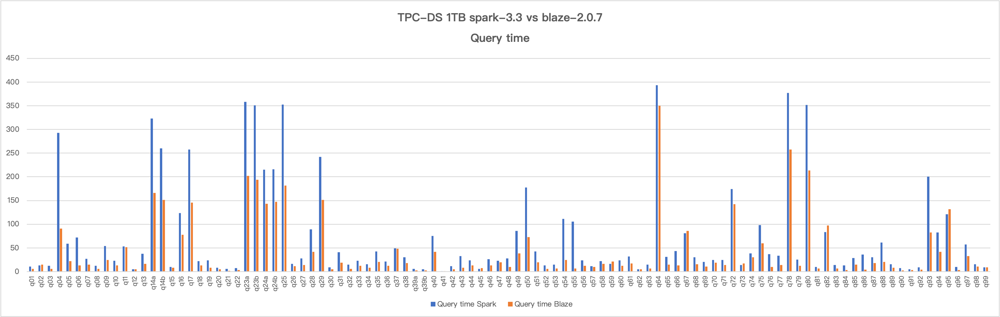
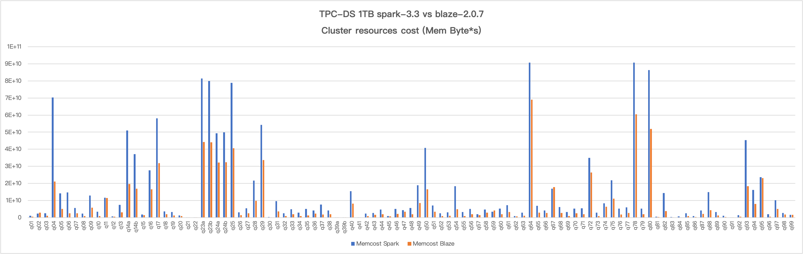

# Report 2023-09-25

### Versions
- Blaze version: [2.0.7](https://github.com/blaze-init/blaze/tree/v2.0.7)
- Vanilla spark version: spark-3.3.3

### Environment
Hadoop 2.6.0 cluster mode running on 4 nodes, See [Kwai server conf](./kwai1-hardware-conf.md).

### Configuration

- Blaze
```properties
spark.executor.memory 5g
spark.executor.memoryOverhead 3072
spark.blaze.memoryFraction 0.7
spark.blaze.enable.caseconvert.functions true
spark.blaze.enable.smjInequalityJoin false
spark.blaze.enable.bhjFallbacksToSmj false
```

- Vanilla Spark
```properties
spark.executor.memory 6g
spark.executor.memoryOverhead 2048
```

- Common configurations
```properties
spark.speculation false
spark.sql.adaptive.coalescePartitions.initialPartitionNum 1000
spark.sql.adaptive.coalescePartitions.minPartitionNum 20
spark.sql.adaptive.coalescePartitions.minPartitionSize 65536
spark.sql.files.maxPartitionBytes 268435456
spark.sql.autoBroadcastJoinThreshold 20971520
```

### Results
Query time comparison (seconds):


Executor time comparison (Memory Bytes * Seconds):


|      | Memcost Spark | Memcost Blaze | Blaze / non-Blaze |      | Query time Spark | Query time Blaze | Blaze / non-Blaze |
| ---- | ------------- | ------------- | ----------------- | ---- | ---------------- | ---------------- | ----------------- |
| q01  | 1064427008    | 465841408     | 0.437645235       | q01  | 10.6             | 5.5              | 0.518867925       |
| q02  | 2368745984    | 2756580608    | 1.163729934       | q02  | 13               | 14.7             | 1.130769231       |
| q03  | 2393231360    | 929133184     | 0.388233749       | q03  | 12               | 6.1              | 0.508333333       |
| q04  | 70389727232   | 21082214400   | 0.299506977       | q04  | 292.8            | 91               | 0.31079235        |
| q05  | 14231480320   | 4988443136    | 0.350521732       | q05  | 58.5             | 22.3             | 0.381196581       |
| q06  | 14682045440   | 2478030848    | 0.168779674       | q06  | 72               | 13               | 0.180555556       |
| q07  | 5505946624    | 2492989184    | 0.452781212       | q07  | 27.3             | 14.3             | 0.523809524       |
| q08  | 2245357056    | 880980864     | 0.392356691       | q08  | 12.3             | 6                | 0.487804878       |
| q09  | 12896677888   | 5840865280    | 0.452896888       | q09  | 53.6             | 24.9             | 0.464552239       |
| q10  | 3314154496    | 850393920     | 0.256594531       | q10  | 22.8             | 12.7             | 0.557017544       |
| q11  | 11654519808   | 11504233472   | 0.987104888       | q11  | 53.4             | 51.5             | 0.964419476       |
| q12  | 686692864     | 435701312     | 0.634492267       | q12  | 5                | 4.5              | 0.9               |
| q13  | 7461695488    | 2950348032    | 0.395399147       | q13  | 37.2             | 16.6             | 0.446236559       |
| q14a | 51038400512   | 19587477504   | 0.383779219       | q14a | 323              | 165.7            | 0.513003096       |
| q14b | 37148839936   | 16872809472   | 0.454194788       | q14b | 259.7            | 151              | 0.581440123       |
| q15  | 1749106432    | 1444340096    | 0.825758839       | q15  | 9.5              | 7.8              | 0.821052632       |
| q16  | 27584167936   | 16530120704   | 0.599261168       | q16  | 123.3            | 77.3             | 0.626926196       |
| q17  | 58074173440   | 31913037824   | 0.549522032       | q17  | 257.3            | 145.2            | 0.564321803       |
| q18  | 3536184832    | 1841279744    | 0.520696692       | q18  | 21.8             | 13.3             | 0.610091743       |
| q19  | 3174092032    | 1262991616    | 0.397906426       | q19  | 24.1             | 7.9              | 0.32780083        |
| q20  | 1256781568    | 877110784     | 0.69790233        | q20  | 8                | 5.3              | 0.6625            |
| q21  | 8047820       | 1677721       | 0.208469002       | q21  | 5.4              | 1.7              | 0.314814815       |
| q22  | 12014388      | 5233048       | 0.435565091       | q22  | 7.4              | 3.3              | 0.445945946       |
| q23a | 81502380032   | 44305956864   | 0.543615497       | q23a | 357.9            | 201.9            | 0.564124057       |
| q23b | 80083304448   | 44114300928   | 0.550855153       | q23b | 351.1            | 193.8            | 0.551979493       |
| q24a | 49402916864   | 32242606080   | 0.652645798       | q24a | 215.1            | 143              | 0.664807066       |
| q24b | 49900470272   | 32306599936   | 0.647420751       | q24b | 215.9            | 147.5            | 0.68318666        |
| q25  | 78905024512   | 40509927424   | 0.513401113       | q25  | 352.4            | 181.5            | 0.515039728       |
| q26  | 2931277056    | 1329268992    | 0.453477773       | q26  | 16.5             | 11.3             | 0.684848485       |
| q27  | 5451323904    | 2441775872    | 0.447923461       | q27  | 28.1             | 13.9             | 0.494661922       |
| q28  | 21703208960   | 9712209920    | 0.447501102       | q28  | 88.8             | 41.8             | 0.470720721       |
| q29  | 54227959808   | 33627506688   | 0.620113809       | q29  | 242              | 151.3            | 0.625206612       |
| q30  | 302891104     | 147115216     | 0.485703324       | q30  | 8.6              | 4.6              | 0.534883721       |
| q31  | 9615978496    | 3625563392    | 0.377035306       | q31  | 41.2             | 18.7             | 0.453883495       |
| q32  | 2419902464    | 903169600     | 0.373225621       | q32  | 14.6             | 6.1              | 0.417808219       |
| q33  | 4866960896    | 1897390848    | 0.389851262       | q33  | 22.6             | 12.4             | 0.548672566       |
| q34  | 2799148544    | 861252800     | 0.30768385        | q34  | 15.4             | 8.2              | 0.532467532       |
| q35  | 5119056896    | 1196330240    | 0.233701298       | q35  | 42.5             | 20.4             | 0.48              |
| q36  | 4177485312    | 2365667328    | 0.566289801       | q36  | 21.4             | 12.4             | 0.579439252       |
| q37  | 7496896512    | 1835760256    | 0.244869361       | q37  | 49.1             | 48.6             | 0.989816701       |
| q38  | 4062855168    | 2003627264    | 0.493157443       | q38  | 30.4             | 17.9             | 0.588815789       |
| q39a | 17670146      | 6130892       | 0.346963291       | q39a | 5.5              | 2.6              | 0.472727273       |
| q39b | 15856440      | 5174066       | 0.326306914       | q39b | 5.3              | 2.2              | 0.41509434        |
| q40  | 15339921408   | 8198391296    | 0.534448064       | q40  | 75.2             | 41.3             | 0.549202128       |
| q41  | 429260        | 425984        | 0.992368262       | q41  | 0.7              | 0.8              | 1.142857143       |
| q42  | 2318457088    | 910912448     | 0.392895971       | q42  | 11.8             | 5.3              | 0.449152542       |
| q43  | 2643484416    | 1599878528    | 0.605215797       | q43  | 32.7             | 8                | 0.244648318       |
| q44  | 4751142912    | 1849382784    | 0.389250085       | q44  | 23.4             | 13.3             | 0.568376068       |
| q45  | 859250816     | 629260352     | 0.732336054       | q45  | 5.7              | 7.3              | 1.280701754       |
| q46  | 5104092160    | 2061359616    | 0.403864106       | q46  | 25.9             | 12.8             | 0.494208494       |
| q47  | 4227521024    | 3306628608    | 0.782167277       | q47  | 22.9             | 19.3             | 0.84279476        |
| q48  | 5522035200    | 1918160384    | 0.347364751       | q48  | 27.8             | 10.1             | 0.363309353       |
| q49  | 18826491904   | 8491696640    | 0.451050397       | q49  | 85.9             | 38.5             | 0.448195576       |
| q50  | 40762097664   | 16581796864   | 0.406794493       | q50  | 177.7            | 72.9             | 0.410241981       |
| q51  | 6946065920    | 3357170944    | 0.483319764       | q51  | 42.2             | 19.9             | 0.471563981       |
| q52  | 2423949056    | 891738560     | 0.367886676       | q52  | 13.3             | 5.9              | 0.443609023       |
| q53  | 2978816512    | 1063898368    | 0.357154717       | q53  | 14.8             | 6.8              | 0.459459459       |
| q54  | 18391373824   | 4836988416    | 0.263003105       | q54  | 111.6            | 24.2             | 0.216845878       |
| q55  | 3162129152    | 904986816     | 0.2861954         | q55  | 105.5            | 6.7              | 0.063507109       |
| q56  | 5093037568    | 1856954368    | 0.364606454       | q56  | 23.8             | 11.9             | 0.5               |
| q57  | 1928995200    | 1409447552    | 0.730664105       | q57  | 11.3             | 10               | 0.884955752       |
| q58  | 4623944704    | 2751867392    | 0.595134148       | q58  | 22.1             | 16.1             | 0.728506787       |
| q59  | 3398420992    | 4046962688    | 1.190836185       | q59  | 16.7             | 21               | 1.25748503        |
| q60  | 5130304512    | 1853107072    | 0.361208008       | q60  | 23.9             | 12.2             | 0.510460251       |
| q61  | 7130669568    | 3167909120    | 0.444265309       | q61  | 31.7             | 17.3             | 0.545741325       |
| q62  | 861110208     | 680694720     | 0.79048502        | q62  | 5.2              | 5.1              | 0.980769231       |
| q63  | 2913974784    | 1040937536    | 0.357222561       | q63  | 14.3             | 6.6              | 0.461538462       |
| q64  | 90821681152   | 69013241856   | 0.759876287       | q64  | 393              | 350.2            | 0.891094148       |
| q65  | 6929706496    | 2843368192    | 0.410315818       | q65  | 31               | 14.4             | 0.464516129       |
| q66  | 4168856064    | 2617344256    | 0.627832723       | q66  | 43               | 13.4             | 0.311627907       |
| q67  | 16813858816   | 17727514624   | 1.054339448       | q67  | 80.9             | 85.8             | 1.060568603       |
| q68  | 6089261056    | 2621406208    | 0.430496604       | q68  | 30.5             | 15.5             | 0.508196721       |
| q69  | 3271612928    | 874701312     | 0.26736088        | q69  | 20.3             | 10.6             | 0.522167488       |
| q70  | 5136711680    | 2550137600    | 0.496453326       | q70  | 24.8             | 19.2             | 0.774193548       |
| q71  | 5308280832    | 1973878784    | 0.371848975       | q71  | 24.9             | 13.8             | 0.554216867       |
| q72  | 34922856448   | 26422075392   | 0.756584028       | q72  | 174.4            | 142.4            | 0.816513761       |
| q73  | 2774287872    | 841416320     | 0.30329092        | q73  | 14.1             | 16.9             | 1.19858156        |
| q74  | 8379421696    | 6379356672    | 0.761312284       | q74  | 38.8             | 30.3             | 0.780927835       |
| q75  | 21823078400   | 11057697792   | 0.506697432       | q75  | 98.5             | 60               | 0.609137056       |
| q76  | 5128589824    | 1697504640    | 0.330988575       | q76  | 36.8             | 10               | 0.27173913        |
| q77  | 6024270336    | 2609286912    | 0.43312912        | q77  | 33.3             | 14.1             | 0.423423423       |
| q78  | 90786725888   | 60526923776   | 0.666693541       | q78  | 377              | 257.2            | 0.682228117       |
| q79  | 5194788864    | 1966597504    | 0.37857121        | q79  | 25.4             | 12.2             | 0.480314961       |
| q80  | 86372556800   | 51899830272   | 0.600883338       | q80  | 351.9            | 213.3            | 0.606138107       |
| q81  | 537159104     | 302697664     | 0.563515841       | q81  | 9.4              | 6.4              | 0.680851064       |
| q82  | 14299611136   | 3833022464    | 0.268050818       | q82  | 83.6             | 97.2             | 1.162679426       |
| q83  | 370437344     | 157327376     | 0.424707116       | q83  | 13.5             | 6.3              | 0.466666667       |
| q84  | 719424896     | 130134840     | 0.180887318       | q84  | 12.9             | 3                | 0.23255814        |
| q85  | 2387102720    | 838269312     | 0.351165999       | q85  | 28.9             | 15.1             | 0.522491349       |
| q86  | 810701824     | 347078592     | 0.428121144       | q86  | 35.8             | 4.1              | 0.11452514        |
| q87  | 4160053504    | 2024300416    | 0.486604418       | q87  | 30.6             | 17.6             | 0.575163399       |
| q88  | 14849074176   | 4215600128    | 0.283896496       | q88  | 61.4             | 20.6             | 0.335504886       |
| q89  | 3119070464    | 1177439232    | 0.377496836       | q89  | 15.7             | 8                | 0.50955414        |
| q90  | 947142592     | 203079744     | 0.214413063       | q90  | 7.5              | 2.5              | 0.333333333       |
| q91  | 140899136     | 51663664      | 0.366671262       | q91  | 5.3              | 3.3              | 0.622641509       |
| q92  | 1332381184    | 414574112     | 0.311152782       | q92  | 9.2              | 4.2              | 0.456521739       |
| q93  | 45288034304   | 18319222784   | 0.404504701       | q93  | 200.3            | 82.3             | 0.410883674       |
| q94  | 16076772352   | 7943606784    | 0.494104576       | q94  | 82.9             | 41.9             | 0.505428227       |
| q95  | 23590234112   | 23093725184   | 0.978952777       | q95  | 120.8            | 131.3            | 1.08692053        |
| q96  | 1928228480    | 512737312     | 0.265911077       | q96  | 9.8              | 3.4              | 0.346938776       |
| q97  | 10208055296   | 5102495232    | 0.499849882       | q97  | 56.9             | 33               | 0.579964851       |
| q98  | 2648099584    | 1700242048    | 0.642061219       | q98  | 15.4             | 10.4             | 0.675324675       |
| q99  | 1629526400    | 1546940288    | 0.949318948       | q99  | 8.7              | 8.9              | 1.022988506       |
|      |               |               |                   |      |                  |                  |                   |
| sum  | 1.50781E+12   | 8.1238E+11    |                   |      | 7367.7           | 4273.8           |                   |
