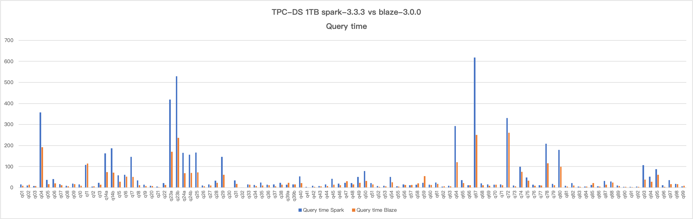
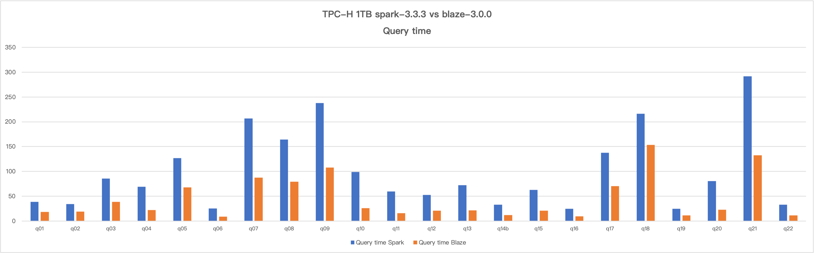

# Report 2024-07-01

### Versions
- Blaze version: [3.0.0](https://github.com/blaze-init/blaze/tree/v3.0.0)
- Vanilla spark version: spark-3.3.3 opensource version

### Environment
Hadoop 2.10.2 cluster mode running on 7 nodes, See [Kwai server conf](./kwai1-hardware-conf.md).

### Configuration

- Blaze
```properties
spark.blaze.enable true
spark.sql.extensions org.apache.spark.sql.blaze.BlazeSparkSessionExtension
spark.shuffle.manager org.apache.spark.sql.execution.blaze.shuffle.BlazeShuffleManager
spark.memory.offHeap.enabled false

# suggested executor memory configuration
spark.executor.memory 4g
spark.executor.memoryOverhead 4096
```

- Vanilla Spark
```properties
spark.executor.memory 6g
spark.executor.memoryOverhead 2048
```

- Common configurations
```properties
spark.master yarn
spark.yarn.stagingDir.list hdfs://blaze-test/home/spark/user/

spark.eventLog.enabled true
spark.eventLog.dir hdfs://blaze-test/home/yarn/spark-eventlog
spark.history.fs.logDirectory hdfs://blaze-test/home/yarn/spark-eventlog

spark.externalBlockStore.url.list hdfs://blaze-test/home/platform
spark.driver.extraJavaOptions -XX:+HeapDumpOnOutOfMemoryError -XX:HeapDumpPath=/media/disk1/spark/ -Djava.io.tmpdir=/media/disk1/tmp -Dlog4j2.formatMsgNoLookups=true
spark.local.dir /media/disk1/spark/localdir

spark.shuffle.service.enabled true
spark.shuffle.service.port 7337

spark.driver.memory 20g
spark.driver.memoryOverhead 4096

spark.executor.instances 10000
spark.dynamicallocation.maxExecutors 10000
spark.executor.cores 5

spark.io.compression.codec zstd

# spark3.3+ disable char/varchar padding
spark.sql.readSideCharPadding false
```

### TPC-DS Results
Blaze saved 46% total query time comparing to spark, benchmarks using the above configuration.
Query time comparison (seconds):


|        | Blaze    | Spark    | Speedup(x) |
| ------ | -------- | -------- | ---------- |
| q1     | 8.946    | 15.073   | 1.68       |
| q2     | 14.558   | 10.482   | 0.72       |
| q3     | 7.892    | 8.239    | 1.04       |
| q4     | 192.499  | 357.818  | 1.86       |
| q5     | 15.943   | 37.471   | 2.35       |
| q6     | 20.139   | 41.034   | 2.04       |
| q7     | 11.274   | 16.532   | 1.47       |
| q8     | 5.922    | 8.885    | 1.50       |
| q9     | 16.797   | 18.52    | 1.10       |
| q10    | 8.908    | 15.634   | 1.76       |
| q11    | 114.716  | 108.502  | 0.95       |
| q12    | 5.923    | 5.642    | 0.95       |
| q13    | 13.641   | 22.386   | 1.64       |
| q14a   | 74.169   | 162.795  | 2.19       |
| q14b   | 71.721   | 187.395  | 2.61       |
| q15    | 27.634   | 57.961   | 2.10       |
| q16    | 51.884   | 61.577   | 1.19       |
| q17    | 51.08    | 146.804  | 2.87       |
| q18    | 10.858   | 33.96    | 3.13       |
| q19    | 7.726    | 13.939   | 1.80       |
| q20    | 7.926    | 8.858    | 1.12       |
| q21    | 2.456    | 4.68     | 1.91       |
| q22    | 13.092   | 21.736   | 1.66       |
| q23a   | 170.957  | 418.987  | 2.45       |
| q23b   | 236.542  | 528.576  | 2.23       |
| q24a   | 68.542   | 164.819  | 2.40       |
| q24b   | 69.916   | 156.236  | 2.23       |
| q25    | 72.066   | 166.081  | 2.30       |
| q26    | 6.899    | 10.715   | 1.55       |
| q27    | 10.116   | 15.436   | 1.53       |
| q28    | 22.418   | 33.152   | 1.48       |
| q29    | 60.618   | 146.133  | 2.41       |
| q30    |          |          | #DIV/0!    |
| q31    | 17.947   | 34.14    | 1.90       |
| q32    | 1.13     | 1.207    | 1.07       |
| q33    | 13.376   | 14.912   | 1.11       |
| q34    | 8.123    | 13.009   | 1.60       |
| q35    | 9.667    | 23.604   | 2.44       |
| q36    | 11.766   | 14.016   | 1.19       |
| q37    | 6.912    | 15.854   | 2.29       |
| q38    | 14.037   | 22.247   | 1.58       |
| q39a   | 23.506   | 14.385   | 0.61       |
| q39b   | 15.658   | 14.812   | 0.95       |
| q40    | 21.323   | 53.26    | 2.50       |
| q41    | 1.636    | 4.159    | 2.54       |
| q42    | 4.386    | 9.169    | 2.09       |
| q43    | 6.184    | 7.436    | 1.20       |
| q44    | 7.177    | 14.616   | 2.04       |
| q45    | 13.453   | 42.177   | 3.14       |
| q46    | 11.486   | 19.182   | 1.67       |
| q47    | 30.546   | 22.316   | 0.73       |
| q48    | 14.617   | 21.361   | 1.46       |
| q49    | 23.28    | 50.818   | 2.18       |
| q50    | 31.91    | 78.861   | 2.47       |
| q51    | 14.767   | 21.594   | 1.46       |
| q52    | 4.402    | 7.476    | 1.70       |
| q53    | 5.893    | 8.728    | 1.48       |
| q54    | 25.024   | 50.243   | 2.01       |
| q55    | 4.607    | 6.456    | 1.40       |
| q56    | 12.508   | 15.227   | 1.22       |
| q57    | 13.066   | 11.239   | 0.86       |
| q58    | 19.706   | 13.923   | 0.71       |
| q59    | 54.67    | 22.584   | 0.41       |
| q60    | 12.192   | 14.538   | 1.19       |
| q61    | 17.277   | 24.019   | 1.39       |
| q62    | 6.786    | 4.75     | 0.70       |
| q63    | 5.849    | 8.618    | 1.47       |
| q64    | 121.374  | 292.479  | 2.41       |
| q65    | 22.164   | 35.938   | 1.62       |
| q66    | 11.608   | 11.713   | 1.01       |
| q67    | 250.606  | 617.991  | 2.47       |
| q68    | 11.785   | 20.809   | 1.77       |
| q69    | 8.581    | 15.859   | 1.85       |
| q70    | 13.819   | 13.642   | 0.99       |
| q71    | 11.371   | 15.644   | 1.38       |
| q72    | 260.602  | 331.28   | 1.27       |
| q73    | 6.464    | 10.715   | 1.66       |
| q74    | 75.604   | 99.419   | 1.31       |
| q75    | 32.963   | 47.765   | 1.45       |
| q76    | 8.876    | 14.479   | 1.63       |
| q77    | 10.093   | 11.927   | 1.18       |
| q78    | 115.239  | 208.522  | 1.81       |
| q79    | 10.867   | 17.617   | 1.62       |
| q80    | 98.788   | 179.521  | 1.82       |
| q81    | 5.629    | 9.121    | 1.62       |
| q82    | 10.638   | 21.232   | 2.00       |
| q83    | 4.092    | 4.624    | 1.13       |
| q84    | 5.152    | 4.547    | 0.88       |
| q85    | 21.524   | 12.985   | 0.60       |
| q86    | 5.256    | 6.288    | 1.20       |
| q87    | 13.981   | 31.153   | 2.23       |
| q88    | 24.139   | 29.653   | 1.23       |
| q89    | 8.124    | 10.193   | 1.25       |
| q90    | 3.507    | 3.555    | 1.01       |
| q91    | 3.121    | 3.695    | 1.18       |
| q92    | 3.525    | 5.06     | 1.44       |
| q93    | 37.673   | 106.785  | 2.83       |
| q94    | 27.961   | 51.743   | 1.85       |
| q95    | 60.55    | 87.68    | 1.45       |
| q96    | 4.003    | 11.587   | 2.89       |
| q97    | 16.22    | 36.13    | 2.23       |
| q98    | 16.228   | 17.334   | 1.07       |
| q99    | 8.363    | 6.842    | 0.82       |
| total: | 3309.135 | 6112.521 | 1.85       |

### TPC-H Results
Blaze saved 55% total query time comparing to spark, benchmarks using the above configuration.
Query time comparison (seconds):


|        | Blaze   | Spark    | Speedup(x) |
| ------ | ------- | -------- | ---------- |
| q01    | 18.436  | 38.834   | 2.11       |
| q02    | 19.276  | 34.415   | 1.79       |
| q03    | 38.373  | 85.78    | 2.24       |
| q04    | 22.427  | 69.202   | 3.09       |
| q05    | 68.087  | 126.88   | 1.86       |
| q06    | 8.945   | 25.513   | 2.85       |
| q07    | 87.404  | 206.581  | 2.36       |
| q08    | 79.142  | 164.408  | 2.08       |
| q09    | 107.604 | 237.855  | 2.21       |
| q10    | 26.112  | 98.856   | 3.79       |
| q11    | 15.511  | 59.842   | 3.86       |
| q12    | 20.874  | 52.742   | 2.53       |
| q13    | 21.404  | 72.36    | 3.38       |
| q14    | 11.752  | 33.146   | 2.82       |
| q15    | 20.925  | 62.572   | 2.99       |
| q16    | 9.378   | 24.72    | 2.64       |
| q17    | 70.05   | 137.646  | 1.96       |
| q18    | 153.348 | 215.998  | 1.41       |
| q19    | 11.616  | 24.857   | 2.14       |
| q20    | 22.572  | 80.441   | 3.56       |
| q21    | 132.751 | 291.799  | 2.20       |
| q22    | 11.561  | 32.92    | 2.85       |
| total: | 977.548 | 2177.367 | 2.23       |
