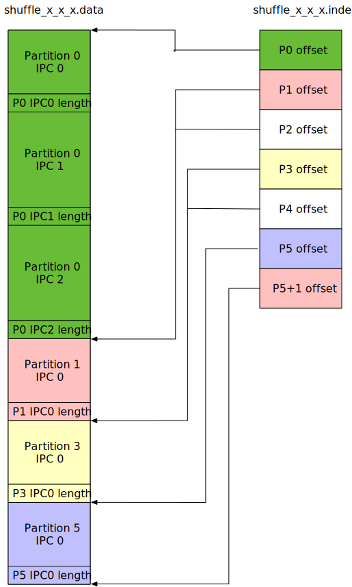

# Stage-based native execution

Principles:

- Execution offloading at stage basis, i.e., a stage is either executed natively in DataFusion
  or kept untouched to run as original JVM-based stage.
- Avoid Java <-> Rust interoperation if possible, especially for data transfers.
  - Shuffle using Segmented Arrow-IPC format for both JVM-stage and Native-stage.

## Shuffle File Format

